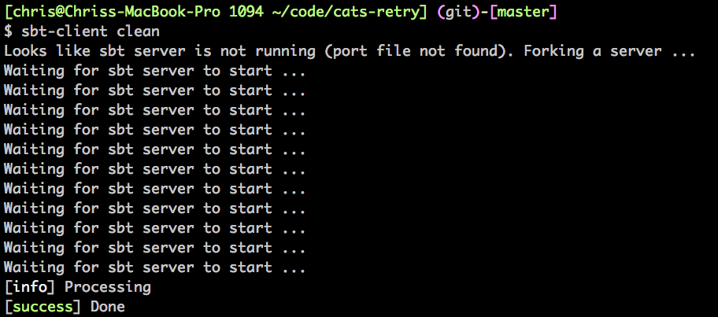
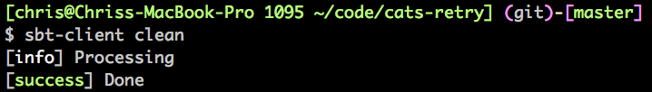
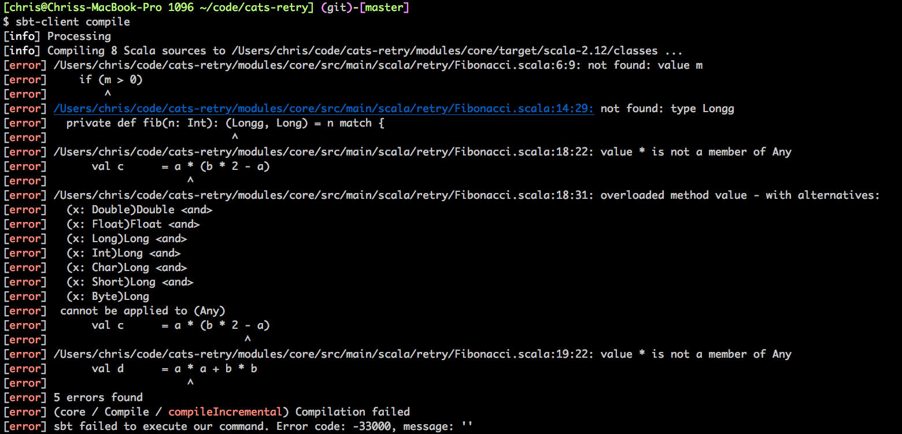

# sbt-client

A thin client for [sbt](https://www.scala-sbt.org/).

Inspired by [Eugene's PR](https://github.com/sbt/sbt/pull/4227), I decided to
write a thin client without the JVM startup overhead.

## How to install

Binaries for Mac and Linux are available on the [releases
page](https://github.com/cb372/sbt-client/releases).

Download and extract the appropriate file for your platform, make the file
executable and put it on your `PATH` somewhere.

e.g.

```
wget https://github.com/cb372/sbt-client/releases/download/v0.1.2/sbt-client-v0.1.2-x86_64-apple-darwin.gz
gzip -d sbt-client-v0.1.2-x86_64-apple-darwin.gz
chmod u+x sbt-client-v0.1.2-x86_64-apple-darwin.gz
mv sbt-client-v0.1.2-x86_64-apple-darwin.gz ~/bin/sbt-client
```

## How to use

In the root directory of an sbt project, run `sbt-client <some sbt command>`.

e.g. `sbt-client clean`.

If sbt is not running, it will automatically start it for you and keep it
running in the background. So the next time you run `sbt-client` it will be much
more snappy.

Note: this assumes that `sbt` is on your `$PATH`. To start the server, sbt-client
simply runs `sbt` with no arguments.

## Examples

`sbt-client clean` starting an sbt server:



`sbt-client clean` again, now that the server is running:



`sbt-client compile` displaying compilation errors:



## Performance

```
$ time sbt-client clean
[info] Processing
[success] Done
sbt-client clean  0.00s user 0.00s system 5% cpu 0.075 total
```

## Compatibility

* Developed and tested on MacOS
* Should also work on Linux
* Will NOT work on Windows
